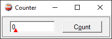
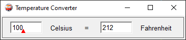

# 7gui-pl

Exercises implementing [7gui] tasks in [Prolog/XPCE][xpce].

[7gui]: https://eugenkiss.github.io/7guis/tasks
[xpce]: https://www.swi-prolog.org/packages/xpce/

## quickstart

Change directories and run the `main.pl` file.

```powershell
swipl-win main.pl
```

## gallery

### counter



### temperature-converter


